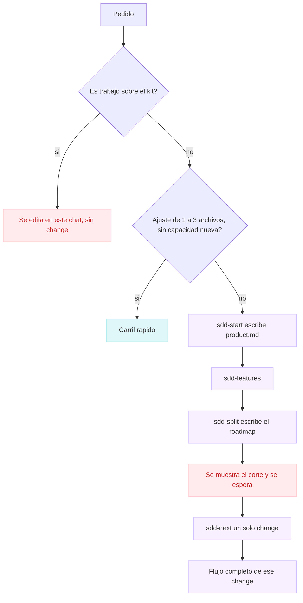
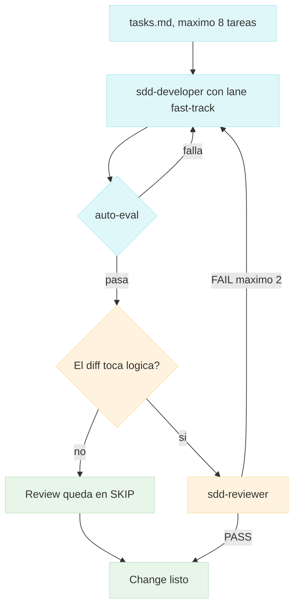
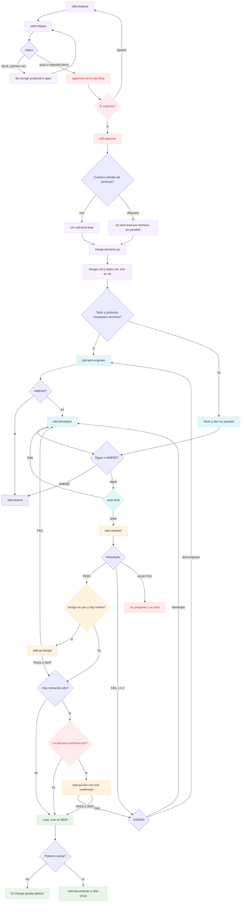
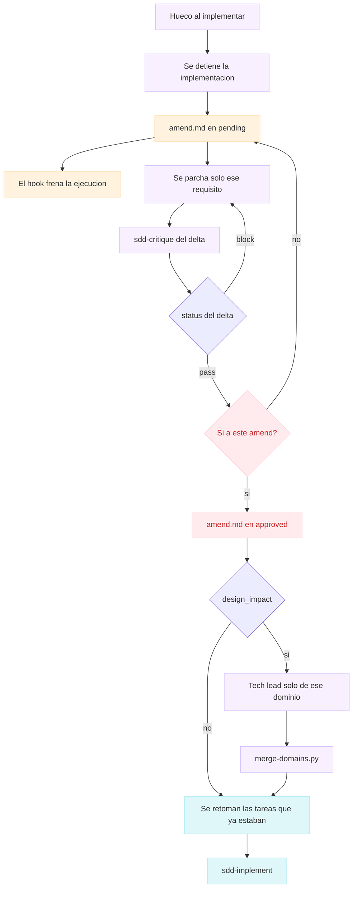

# Orquestador SDD

Kit de Cursor para desarrollar con specs y varios agentes, sin atarse a un stack. OpenSpec guarda cada cambio. Este repo reparte el trabajo: triage, critique, aprobación humana, tech leads por dominio, dev, tests, review y el QA que el propio cambio pide.

La forma de empaquetar (comandos, agentes, skills, hooks) sale de la misma idea que un kit de estudio que ya funcionaba. El contenido de aquí no arrastra ese dominio: el stack vive en `openspec/config.yaml` y el chequeo en un comando del repo.

## Decisión

OpenSpec es el único motor de specs. Spec Kit no se instala al lado: sus compuertas (constitution, clarify, analyze, converge) están cubiertas por el config, el critique y el review. El detalle está en [docs/decision.md](docs/decision.md). Los flujos están en [Flujos](#flujos).

## Instalación

En el repo de la aplicación:

```bash
git clone <este-repo> ~/orchestrator-agents-development
~/orchestrator-agents-development/install.sh .
```

Opcional, para `openspec list`, `openspec schema validate` y `openspec archive`:

```bash
npm install -g @fission-ai/openspec@latest
cd <tu-app>
openspec init
```

`install.sh` copia agentes, comandos, el skill, los hooks y los schemas `sdd-orchestrated` y `sdd-fast`. Si no hay `openspec/config.yaml`, escribe uno de ejemplo. Completa ahí el stack y las reglas. No dejes un framework inventado.

El chequeo barato, antes del reviewer, es del proyecto:

```bash
cp examples/sdd-auto-eval.cmd .cursor/sdd-auto-eval.cmd
# edita el archivo: lint, tipos o tests rápidos. exit 0 si pasa.
```

Sin ese archivo, `auto-eval.sh` usa las líneas `command:` del change y, si el repo es Node y tiene `lint` o `typecheck`, esos scripts.

Después de editar `agents/`, `commands/`, `skills/`, `hooks/` o `tools/` en este kit, vuelve a correr `./install.sh` en cada app y en este repo.

## Carriles

| Carril | Cuándo | Schema |
| --- | --- | --- |
| Rápido (default) | Todo lo que no cambia capacidad, contrato, datos persistentes ni un flujo de usuario | `sdd-fast` |
| Completo | Capacidad nueva, contrato, datos persistentes o flujo nuevo | `sdd-orchestrated` |

En el completo, el producto se parte en features y en changes chicos. Se implementa uno por vez, con critique y aprobación. Cada capacidad nombrada queda en la lista. Si el config pide un stack visual, la primera pantalla lo usa.

## Flujos

El chat principal enruta. Un producto con varias capacidades no entra a implementar de una vez.

### Enrutado



`/sdd-start` pregunta el resultado y el stack, y lista cada capacidad. `/sdd-features` le pone criterios. `/sdd-split` arma cortes chicos y no implementa. `/sdd-next` corre proposal, critique, aprobación, plan, dev y review solo para el primero que esté libre.

### Carril rápido

Schema `sdd-fast`. Sin proposal, sin critique, sin tech lead, sin diseño, sin e2e y sin documenter.



El hook deja pasar a este dev porque el prompt trae `lane: fast-track` o el schema es `sdd-fast`.

### Carril completo

Schema `sdd-orchestrated`. El proposal cabe en 40 líneas y hay un solo spec. El critique hace como máximo cinco preguntas.



Mientras `approval.md` está en `pending`, el hook niega a tech lead, dev, tests, review, QA y documenter. El critique no está en ese hook.

### Amend

Sale del carril completo cuando el test engineer o el dev no pueden seguir sin inventar comportamiento. No se abre otro change y no se reabre el `approval.md` original.



El critique del amend lee `amend.md` y el requisito citado. Con `design_impact: yes` vuelve a planificar solo ese dominio.

## Comandos

En el chat del repo instalado:

| Comando | Qué hace |
| --- | --- |
| `/sdd-start` | Pregunta, escribe el producto y se detiene |
| `/sdd-features` | Lista cada capacidad con criterios |
| `/sdd-split` | Parte el producto en changes chicos, sin implementar |
| `/sdd-next` | Corre el flujo completo de un solo change |
| `/sdd-triage` | Elige carril |
| `/sdd-propose` | Proposal y specs |
| `/sdd-critique` | Huecos y choques con las reglas; después se detiene |
| `/sdd-approve` | Pasa a `approved` con un sí de la persona |
| `/sdd-plan` | Tech leads por dominio, `design.md` y `tasks.md` |
| `/sdd-implement` | Tests, dev y auto-eval |
| `/sdd-amend` | Parcha el spec y relanza solo el critique |
| `/sdd-review` | Code review y e2e solo con un sí |
| `/sdd-status` | Changes activos |
| `/sdd-close` | Archiva y, si lo pides, abre el PR |

También puedes pedir el flujo en prosa. El skill `sdd-orchestrator` enruta.

## Agentes

`sdd-triage`, `sdd-critique`, `sdd-tech-lead`, `sdd-developer`, `sdd-test-engineer`, `sdd-reviewer`, `sdd-qa-design`, `sdd-qa-e2e`, `sdd-documenter`.

El orquestador es el chat principal. Los subagentes no ven la conversación: el prompt lleva el slug, el carril y el dominio.

## Hooks y herramientas

- `subagentStart` niega a los agentes de ejecución si el change no está aprobado y no es fast-track.
- `subagentStop` del dev pide auto-eval una vez si falta `.eval-pass`.
- `.cursor/sdd-tools/merge-domains.py` une `domains/*.md` en `design.md` y `tasks.md`.
- `.cursor/sdd-tools/change-status.py` resume changes sin el CLI.
- `./tools/self-check.sh` prueba schemas, el gate, el merge y el auto-eval.

## Fuente

Edita las carpetas de la raíz (`agents`, `commands`, `skills`, `schemas`, `hooks`, `tools`). `.cursor/` y `openspec/schemas/` de este repo las regenera `./install.sh`.
