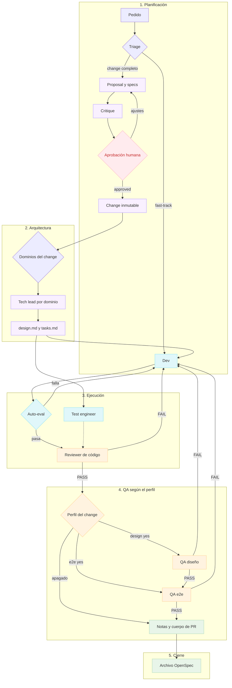

# Flujo

```mermaid
flowchart TD
  classDef planning fill:#f9f0ff,stroke:#d0bfff,stroke-width:2px
  classDef dev fill:#e0f7fa,stroke:#b2ebf2,stroke-width:2px
  classDef qa fill:#fff3e0,stroke:#ffe0b2,stroke-width:2px
  classDef doc fill:#e8f5e9,stroke:#c8e6c9,stroke-width:2px
  classDef human fill:#ffebee,stroke:#ffcdd2,stroke-width:2px,color:#c62828

  subgraph plan [1. Planificación]
    pedido[Pedido] --> triage{Triage}
    triage -->|fast-track| dev
    triage -->|change completo| propose[Proposal y specs]
    propose --> critique[Critique]
    critique --> hitl{Aprobación humana}
    hitl -->|ajustes| propose
    hitl -->|approved| rfc[Change inmutable]
  end

  subgraph arch [2. Arquitectura]
    rfc --> split{Dominios del change}
    split --> leads[Tech lead por dominio]
    leads --> tasks[design.md y tasks.md]
  end

  subgraph exec [3. Ejecución]
    tasks --> tests[Test engineer]
    tasks --> dev[Dev]
    dev --> eval{Auto-eval}
    eval -->|falla| dev
    eval -->|pasa| review[Reviewer de código]
    tests -.-> review
  end

  subgraph qa [4. QA según el perfil]
    review -->|FAIL| dev
    review -->|PASS| router{Perfil del change}
    router -->|design yes| qadesign[QA diseño]
    router -->|e2e yes| qae2e[QA e2e]
    router -->|apagado| documenter
    qadesign -->|PASS| qae2e
    qadesign -->|FAIL| dev
    qae2e -->|PASS| documenter
    qae2e -->|FAIL| dev
  end

  subgraph close [5. Cierre]
    documenter[Notas y cuerpo de PR] --> archive[Archivo OpenSpec]
  end

  class propose,critique,rfc,leads,tasks planning
  class dev,tests,eval dev
  class review,qadesign,qae2e,router qa
  class documenter,archive doc
  class hitl human
```

Los dominios no están fijos. Un change de una sola pieza usa un tech lead. Dos árboles de archivos disjuntos se planifican en paralelo.
